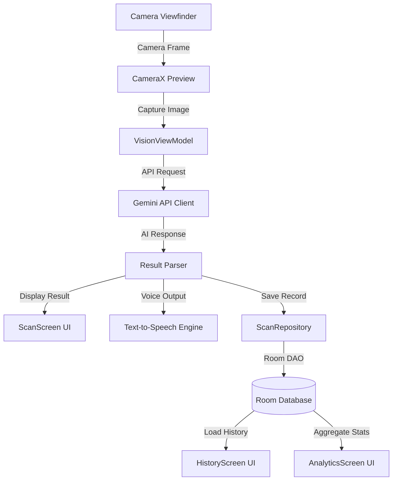
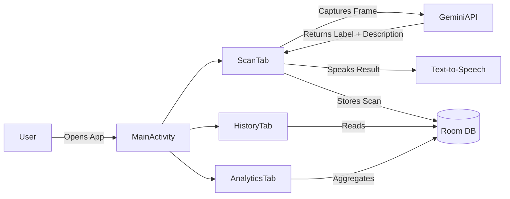

<div align="center">

# Vision AI
### Real-Time AI Camera Identification for Android

> Powered by Google Gemini API — Instantly identify objects, plants, animals, landmarks, text, and QR codes through your camera, with voice narration and full scan history.

[](https://developer.android.com)
[](https://kotlinlang.org)
[](https://developer.android.com/jetpack/compose)
[](https://ai.google.dev)
[](./LICENSE)
[](https://github.com/tusharkkp/APP/stargazers)
[](https://github.com/tusharkkp/APP/network/members)

</div>

---

## Problem Statement

Every day, people encounter unfamiliar objects, plants, animals, and text in the physical world with no quick way to identify them. Traditional search engines require typing — slow, impractical, and often inaccurate without the right vocabulary. Vision AI solves this by turning your Android camera into an **instant AI-powered identification engine**, giving users real-time answers about anything they point their camera at, delivered through both text and voice.

**Pain points addressed:**
- No quick way to identify unknown plants, insects, or animals in the wild
- Language barriers when encountering text in foreign scripts
- Inaccessible UI for visually-challenged users (solved via voice narration)
- No persistent history for tracking past scans
- QR codes requiring separate apps to decode

---

## Features

### Core Identification Capabilities
- **Object Detection** — Identify everyday objects in real time using Gemini Vision
- **Plant Identification** — Recognize plant species, flowers, and trees instantly
- **Animal Recognition** — Detect and name animals, insects, birds, and more
- **Landmark Detection** — Identify famous monuments, buildings, and geographical features
- **Text Recognition (OCR)** — Extract and translate text from images
- **QR Code Scanner** — Decode QR codes with AI context understanding

### User Experience
- **Voice Narration** — Accessibility-first audio output for all identification results
- **Scan History** — Full local history of all past scans powered by Room Database
- **Analytics Dashboard** — Visual metrics and stats on scan activity
- **Edge-to-Edge UI** — Modern immersive Android design with Jetpack Compose Material 3
- **Bottom Navigation** — Seamless switching between Scan, History, and Metrics tabs

### Technical Highlights
- **Server-Side Gemini API** — AI processing via Google's multimodal Gemini model
- **MVVM Architecture** — Clean ViewModel + Repository pattern
- **Offline History** — Room Database stores all scan records locally
- **Modular Codebase** — Separated into `api`, `camera`, `data`, `ui`, and `utils` packages

---

## Architecture



### Application Flow



---

## Tech Stack

| Layer | Technology | Purpose |
|-------|-----------|--------|
| **Language** | Kotlin | Primary Android development language — concise, null-safe, coroutine-native |
| **UI Framework** | Jetpack Compose + Material 3 | Declarative, modern UI with edge-to-edge support |
| **AI / ML** | Google Gemini API (Server-Side) | Multimodal vision inference for all identification tasks |
| **Camera** | CameraX | Stable, lifecycle-aware camera preview and capture |
| **Local DB** | Room Database | Persistent offline storage for scan history |
| **Architecture** | MVVM + Repository | Separation of concerns, testable codebase |
| **TTS** | Android TextToSpeech | Accessibility voice narration for scan results |
| **Build System** | Gradle KTS | Kotlin DSL-based build configuration |
| **Testing** | JUnit + AndroidX Test | Unit and instrumented testing infrastructure |

---

## Project Structure

```
APP/
├── app/
│   ├── src/
│   │   ├── main/
│   │   │   ├── java/com/example/
│   │   │   │   ├── api/           # Gemini API client and request builders
│   │   │   │   ├── camera/        # CameraX integration and frame capture
│   │   │   │   ├── data/          # Room Database, DAO, Repository, entities
│   │   │   │   ├── ui/
│   │   │   │   │   ├── screens/   # ScanScreen, HistoryScreen, AnalyticsScreen
│   │   │   │   │   ├── theme/     # Material 3 theme configuration
│   │   │   │   │   └── viewmodel/ # VisionViewModel + ViewModelFactory
│   │   │   │   ├── utils/         # Utility helpers and extensions
│   │   │   │   └── MainActivity.kt
│   │   │   ├── res/               # Android resources (layouts, strings, icons)
│   │   │   └── AndroidManifest.xml
│   │   ├── androidTest/           # Instrumented UI tests
│   │   └── test/                  # Unit tests
│   └── build.gradle.kts
├── gradle/
├── .env.example                   # Environment variable template
├── metadata.json                  # AI Studio app metadata
├── build.gradle.kts
└── settings.gradle.kts
```

---

## Installation & Setup

### Prerequisites

- [Android Studio](https://developer.android.com/studio) (Hedgehog or later)
- Android device or emulator running API 26+
- A [Google Gemini API Key](https://aistudio.google.com/app/apikey)

### Step-by-Step Setup

1. **Clone the repository**
   ```bash
   git clone https://github.com/tusharkkp/APP.git
   cd APP
   ```

2. **Open in Android Studio**
   - Launch Android Studio
   - Select **File > Open** and choose the cloned `APP` directory
   - Wait for Gradle sync to complete

3. **Configure environment variables**
   ```bash
   # Create your .env file from the template
   cp .env.example .env
   ```
   Then edit `.env` and set your Gemini API key:
   ```env
   GEMINI_API_KEY=your_actual_gemini_api_key_here
   ```

4. **Fix signing configuration (for local debug builds)**
   
   Open `app/build.gradle.kts` and remove this line from the `release` build type:
   ```kotlin
   signingConfig = signingConfigs.getByName("debugConfig")
   ```

5. **Run the application**
   - Connect your Android device or start an emulator
   - Click **Run** (Shift+F10) in Android Studio
   - Grant camera and microphone permissions when prompted

---

## Environment Variables

Create a `.env` file in the project root (see `.env.example` for reference):

| Variable | Required | Description |
|----------|----------|-------------|
| `GEMINI_API_KEY` | Yes | Your Google Gemini API key from [Google AI Studio](https://aistudio.google.com/app/apikey) |

> **Security Note:** Never commit your actual `.env` file. It is already included in `.gitignore`.

---

## Usage Guide

### Scan Tab
1. Open the app — the camera viewfinder launches immediately
2. Point your camera at any **object, plant, animal, landmark, text, or QR code**
3. Tap the capture button to identify
4. View the AI-generated description on screen
5. Listen to the **voice narration** of the result

### History Tab
- Browse all previous scans in chronological order
- Each entry shows the identified label, timestamp, and category

### Analytics Tab (Metrics)
- View graphical breakdown of scan categories
- Track your identification activity over time

---

## API Reference

This app uses the **Google Gemini API** (server-side) for all vision inference.

| Capability | Gemini Feature | Description |
|-----------|---------------|-------------|
| Object/Animal/Plant Detection | Multimodal Vision | Sends captured frame to Gemini, receives structured label + description |
| Text Recognition | OCR via Vision | Extracts text content from image frames |
| QR Code Decoding | Vision Understanding | Interprets QR code content with contextual awareness |
| Landmark Recognition | Knowledge + Vision | Identifies famous places using Gemini's world knowledge |

**Capability Declaration (metadata.json):**
```json
{
  "name": "Vision AI",
  "majorCapabilities": ["MAJOR_CAPABILITY_SERVER_SIDE_GEMINI_API"]
}
```

---

## Performance & Scalability

- **Modular Architecture** — Each feature (camera, data, API, UI) is independently maintained
- **Offline-First History** — Room Database ensures scan history works without internet
- **Coroutine-Based Async** — All API calls are non-blocking via Kotlin Coroutines
- **ViewModel State Management** — UI state is decoupled from business logic
- **Lifecycle-Aware Components** — CameraX and ViewModels respect Android lifecycle

---

## Future Scope

- [ ] **Multi-language Voice Output** — TTS in Hindi, Spanish, French, and more
- [ ] **Offline Identification Mode** — On-device ML with TensorFlow Lite fallback
- [ ] **Cloud Sync** — Backup scan history to Firebase Firestore
- [ ] **Social Sharing** — Share scan results as image cards
- [ ] **Batch Scanning Mode** — Scan multiple items in one session
- [ ] **AR Overlay** — Display identification labels as AR overlays on camera
- [ ] **Google Play Release** — Publish to Play Store with full onboarding
- [ ] **Widget Support** — Quick-scan Android home screen widget

---

## Contributing

Contributions are welcome! Please read [CONTRIBUTING.md](./CONTRIBUTING.md) before submitting a pull request.

**Quick contribution steps:**
1. Fork the repository
2. Create a feature branch: `git checkout -b feature/your-feature-name`
3. Commit your changes: `git commit -m 'feat: add your feature'`
4. Push to the branch: `git push origin feature/your-feature-name`
5. Open a Pull Request

See [CODE_OF_CONDUCT.md](./CODE_OF_CONDUCT.md) for community standards.

---

## License

This project is licensed under the **MIT License** — see the [LICENSE](./LICENSE) file for details.

---

## Author

<div align="center">

**Tushar Kaldate**

[](https://github.com/tusharkkp)
[](https://www.linkedin.com/in/tushar-kaldate-2b5276262/)

*Built with Google AI Studio — Gemini API*

</div>

---

<div align="center">

**If this project helped you, please consider giving it a star!**

[](https://github.com/tusharkkp/APP/stargazers)

</div>
